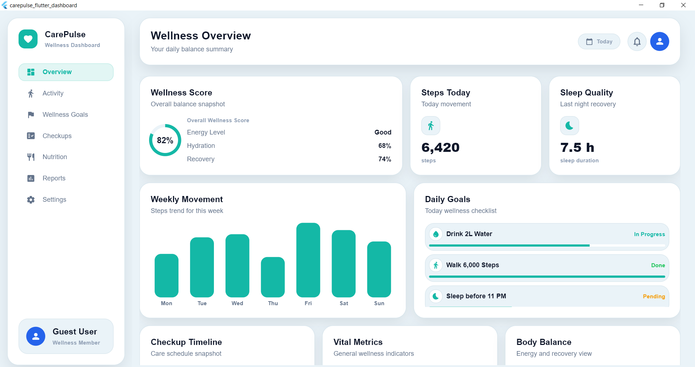
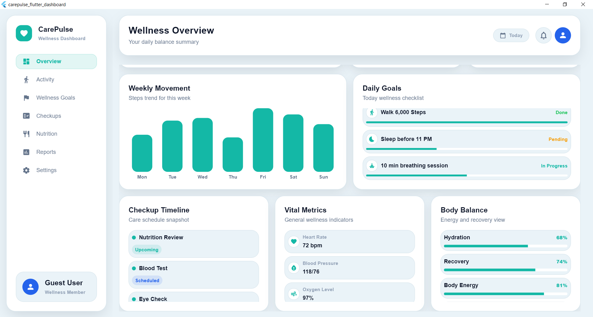
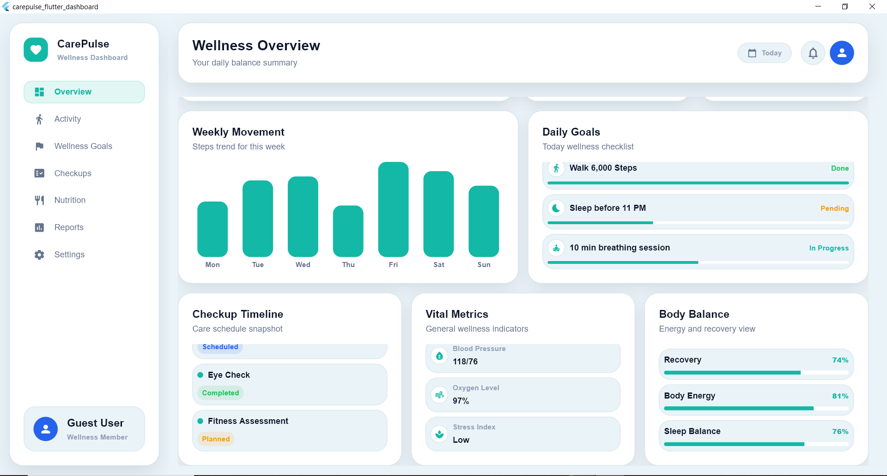
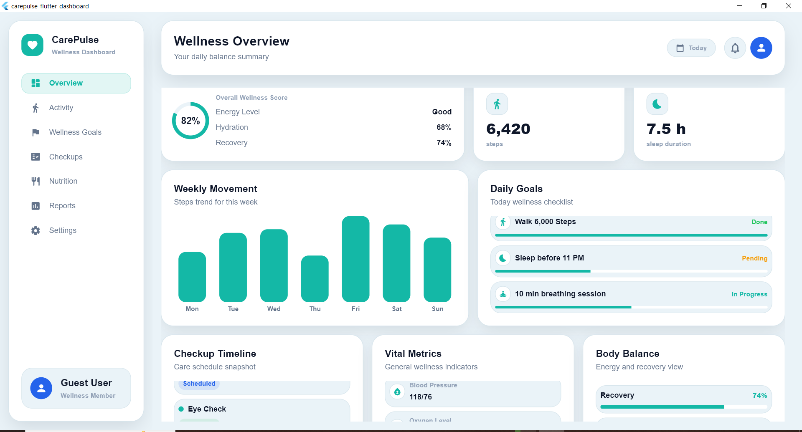

# BinarWell Flutter Dashboard

BinarWell Flutter Dashboard is an educational Flutter UI practice project that demonstrates how to build a clean, responsive, and visually polished wellness dashboard using Flutter and Dart.

This project is designed as an inspired wellness dashboard concept. It uses mock data only and does not connect to any backend, database, API, or real medical service.

---

## Project Purpose

The purpose of this project is to practice building a professional dashboard interface using Flutter.

The project focuses on:

- Clean Flutter project structure
- Reusable UI components
- Dashboard layout design
- Design tokens
- Mock data separation
- Responsive layout improvement
- UI polish
- Testing and validation gates

This project can be used as a portfolio example for Flutter UI development and dashboard interface design.

---

## Project Scope

This project includes a complete front-end dashboard UI only.

The current scope includes:

- Wellness sidebar
- Dashboard header
- Wellness score card
- Summary metric cards
- Weekly movement chart
- Daily goals card
- Checkup timeline card
- Vital metrics card
- Body balance card
- Centralized mock data
- Responsive layout behavior
- UI polish using shared theme tokens

---

## Features

### Dashboard Shell

The dashboard includes a structured shell with:

- Left sidebar
- Main content area
- Header section
- Dashboard content grid

### Wellness Sidebar

The sidebar includes:

- BinarWell logo area
- Navigation menu
- User profile card

Menu items include:

- Overview
- Activity
- Wellness Goals
- Checkups
- Nutrition
- Reports
- Settings

### Dashboard Header

The header includes:

- Page title
- Short subtitle
- Today label
- Notification icon placeholder
- User avatar placeholder

### Dashboard Cards

The dashboard currently includes:

- Wellness Score
- Steps Today
- Sleep Quality
- Weekly Movement
- Daily Goals
- Checkup Timeline
- Vital Metrics
- Body Balance

### Mock Data Separation

Mock dashboard data is separated into a dedicated data layer:

```text
lib/features/dashboard/data/mock_BinarWell_data.dart
```

This keeps the dashboard UI cleaner and prevents hardcoded mock values from being scattered across widgets.

### Responsive Layout

The dashboard layout was improved to behave better across different screen sizes.

Current responsive behavior includes:

- Minimum dashboard width for desktop-style layout
- Horizontal scroll support when the screen width is smaller than the dashboard minimum width
- Flexible main content area
- Stable sidebar and content layout
- Better spacing between dashboard sections

### UI Polish

The UI polish stage improved the dashboard visual quality through:

- Shared shadow tokens
- Better card shadows
- Better header shadow
- Better sidebar shadow
- Improved background/card contrast
- Stronger border visibility
- Cleaner separation between page background and dashboard surfaces

---

## Design Tokens

The project uses shared theme tokens to keep styling consistent.

Current theme-related files include:

```text
lib/app/theme/app_colors.dart
lib/app/theme/app_shadows.dart
```

### AppColors

`AppColors` centralizes the main dashboard colors, including:

- Background color
- Surface color
- Border color
- Primary text color
- Secondary text color
- Accent colors

### AppShadows

`AppShadows` centralizes reusable shadow styles.

Current shadow tokens include:

- Card shadow
- Panel shadow

This makes the UI easier to maintain because shadow changes can be controlled from one place instead of being repeated across many widgets.

---

## Main Project Structure

The most important project folders are:

```text
lib/
  app/
    theme/
      app_colors.dart
      app_shadows.dart

  features/
    dashboard/
      data/
        mock_BinarWell_data.dart

      layout/
        dashboard_shell.dart
        dashboard_main_area.dart
        dashboard_header.dart
        dashboard_content_grid.dart
        wellness_sidebar.dart

      widgets/
        dashboard_card.dart

test/
  widget_test.dart
```

---

## Development Stages

The project was built step by step using small implementation stages.

Completed stages include:

- C001 — Project foundation
- C002 — Basic dashboard shell
- C003 — Sidebar structure
- C004 — Header structure
- C005 — Dashboard content area
- C006 — Card components
- C007 — Wellness score card
- C008 — Summary metric cards
- C009 — Weekly movement section
- C010 — Daily goals section
- C011 — Checkup timeline section
- C012 — Vital metrics section
- C013 — Body balance section
- C014 — Layout refinement
- C015 — Component cleanup
- C016 — Visual check
- C017 — Mock data separation
- C018 — Responsive layout improvement
- C019 — UI polish

---

## Latest Completed Stage

```text
C019 — UI Polish
```

### C019 Summary

C019 focused on improving the visual quality of the dashboard without adding new features.

Completed improvements:

- Created `AppShadows`
- Updated card shadows
- Updated header shadow
- Updated sidebar shadow
- Improved background/card contrast
- Improved border visibility
- Preserved the existing dashboard structure
- Kept the UI clean, soft, and professional

### C019 Final Result

The dashboard now has better visual separation between:

- Page background
- Sidebar
- Header
- Dashboard cards

The final visual check passed successfully.

---

## Validation

The project uses formatting, static analysis, widget testing, and manual visual checking as quality gates.

Recommended validation commands:

```powershell
dart format lib test
flutter analyze
flutter test
flutter run -d windows
```

Latest validation result:

```text
dart format lib test: PASSED
flutter analyze: PASSED — No issues found
flutter test: PASSED — All tests passed
flutter run -d windows: PASSED
```

---

## How to Run the Project

### 1. Open the Project

Open the project folder in VS Code.

Or use:

```powershell
cd BinarWell_flutter_dashboard
code .
```

### 2. Get Dependencies

Run:

```powershell
flutter pub get
```

### 3. Run Static Analysis

Run:

```powershell
flutter analyze
```

### 4. Run Tests

Run:

```powershell
flutter test
```

### 5. Run on Windows

Run:

```powershell
flutter run -d windows
```

---

## Requirements

Recommended environment:

- Flutter SDK installed
- Dart SDK included with Flutter
- VS Code
- Flutter extension for VS Code
- Dart extension for VS Code
- Windows desktop support enabled if running on Windows

To check Flutter installation:

```powershell
flutter doctor
```

To enable Windows desktop support if needed:

```powershell
flutter config --enable-windows-desktop
```

---

## Important Notes

This project is for educational and portfolio purposes only.

It is not:

- A real medical application
- A patient monitoring system
- A clinical decision system
- A backend-connected health platform
- A replacement for professional healthcare software

All values shown in the dashboard are mock data.

---

## Portfolio Value

This project demonstrates the ability to:

- Build a structured Flutter dashboard
- Organize UI into reusable components
- Use shared design tokens
- Separate mock data from UI widgets
- Improve responsive layout behavior
- Apply visual polish carefully
- Validate the project using Flutter quality checks
- Document development stages clearly

This makes the project suitable as a Flutter UI portfolio example.

---

## Recommended Next Stage

```text
C020 — Documentation and Structure Review
```

Suggested next focus:

- Review folder structure
- Clean unused files if any exist
- Confirm naming consistency
- Review component responsibilities
- Prepare project screenshots
- Prepare GitHub-ready documentation
- Prepare a final portfolio presentation

---

## Status

```text
Current Status: C019 Completed
Next Stage: C020 — Documentation and Structure Review
Project Type: Educational Flutter UI Dashboard
Data Type: Mock Data Only
Backend: Not Connected
Database: Not Connected
API: Not Connected
Medical Use: Not Intended
```

---

## License

This project can be used as an educational and portfolio project.

Before publishing publicly, make sure that:

- No private data is included
- No real patient data is included
- No copyrighted design is copied directly
- The project identity, name, and UI are original or properly inspired

---

## Author

Developed as a Flutter dashboard UI practice project.

Project name:

```text
BinarWell Flutter Dashboard
```


---

## Screenshots

### Dashboard Overview



### Wellness Cards



### Responsive Dashboard Layout



### Final UI Polish




---

## Release 2 — Activity-First Multi-Page Expansion

Release 2 expands the BinarWell Flutter Dashboard from a single Overview dashboard into a multi-page wellness dashboard experience.

The main addition in this release is a dedicated Activity page with its own navigation identity, layout, visual cards, responsive behavior, and widget test coverage.

### Release 2 Highlights

- Added multi-page dashboard navigation
- Added Activity page integration
- Added Activity sidebar active state
- Added Activity models and mock data
- Added Today's Movement card
- Added Activity Goals card
- Added Hourly Movement chart card
- Added Today's Activity Sessions card
- Added Intensity Zones card
- Added Activity Insights card
- Improved responsive behavior for Activity layout
- Added Activity widget test coverage
- Added Release 2 documentation package

### Activity Page Components

The Activity page includes:

- Activity page header
- Today / Week / Month filter
- Today's Movement summary
- Activity Goals progress overview
- Hourly Movement chart
- Today's Activity Sessions
- Intensity Zones
- Activity Insights

### Validation

Release 2 has been validated with:

```text
flutter analyze: No issues found!
flutter test: All tests passed!
```

### Screenshots

Release 2 screenshots are organized under:

```text
docs/screenshots/release_2/
```

Recommended screenshots include:

- Activity page large desktop
- Activity page medium desktop
- Activity page small window
- Sidebar Activity active state
- Flutter analyze result
- Flutter test result

### Current Scope

This project is currently a front-end Flutter dashboard prototype using mock data only.

It does not include:

- Backend integration
- Authentication
- Real health data connection
- Database persistence
- Real wearable device integration
- Real report export


---

## BinarWell Flutter Dashboard v1.2.0

### Release 3 — Wellness Goals Expansion

Release 3 adds a dedicated Wellness Goals page to BinarWell Flutter Dashboard.

The new page focuses on daily goal tracking, weekly planning, category progress, recent achievements, and wellness insights.

### Release 3 Highlights

- Added Wellness Goals page
- Added Wellness Goals sidebar navigation item
- Added active sidebar state
- Added Wellness Goals data models
- Added Wellness Goals mock data
- Added summary KPI cards
- Added Today's Goal Checklist
- Added Goal Focus of the Week
- Added Weekly Goal Planner
- Added Goal Categories
- Added Recent Achievements
- Added Wellness Insights
- Added Widget test coverage
- Updated visual spacing and dashboard background
- Prepared Release 3 documentation

### Wellness Goals Sections

The Wellness Goals page includes:

- Today's Goal Completion
- Current Streak
- Active Goals
- Weekly Completion Rate
- Today's Goal Checklist
- Goal Focus of the Week
- Weekly Goal Planner
- Goal Categories
- Recent Achievements
- Wellness Insights

### Quality Checks

Release 3 was validated using:

```powershell
dart format lib test
flutter analyze
flutter test
flutter run -d windows

Release 3 Documentation

Release 3 documentation is available in:

docs/release_3/
docs/screenshots/release_3/
Version History
v1.0.0 — Initial polished dashboard release
v1.1.0 — Activity-first multi-page expansion
v1.2.0 — Wellness Goals expansion

